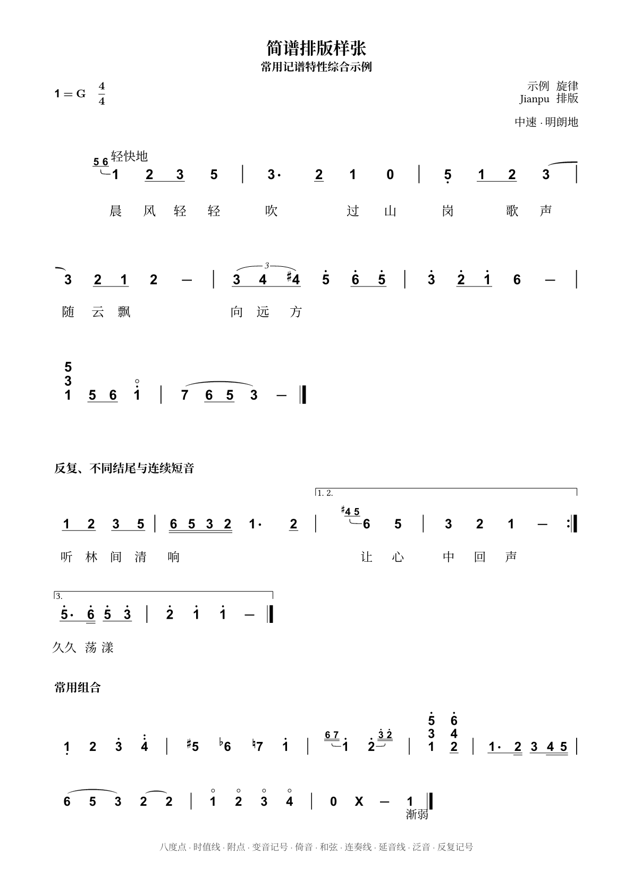

# Jianpu

English | [简体中文](README.md)

Jianpu is a work-in-progress package for typesetting numbered musical notation in Typst. It supports automatic system breaking at bar lines, duration lines, octave dots, chords, grace notes, tuplets, slurs, ties, repeats, lyrics, annotations, and inline notation.



## Font Requirements

Numerals use Arial by default. Accidentals and attached music symbols use Bravura Text. These fonts are not bundled with the package, so they must be installed or supplied through Typst's `--font-path` option. The numeral font can be changed with the `font` parameter.

## Quick Start

```typst
#import "@preview/jianpu:0.1.0": jianpu, jianpu-inline, jianpu-title

#jianpu(```melody
1 2 3 4 | 5/ 6/ 7/ 1/ |
```)
```

Use raw blocks to attach lyrics to the preceding melody:

```typst
#jianpu(
  ```melody
  1 2 3 4 | 5 6 7 1 |
  ```,
  ```lyrics
  Twin-kle twin-kle lit-tle star |
  ```,
)
```

Inline notation inherits the surrounding text size:

```typst
Text before #jianpu-inline("1 2/ 3//. 4'") text after.
```

## Custom Tracks

Register an external raw language with `tracks`. The score renderer has no dependency on the extension package:

```typst
#let qin-score = jianpu.with(tracks: (jianzi: init-track()))
```

Here `init-track` comes from the separate jianzi package. Attached tracks follow the preceding melody's main-note slots and line breaks. Chords consume one slot; grace notes and extension dashes consume none.

A descriptor provides `parse(source)`, returning an array with `none` for skipped slots, and `render-item(data)`, returning `(body: content, anchor-x: length)` in a Typst context. The body is a fully laid-out box, and the anchor is measured from its left edge before scaling. Optional `height` (default `1em`) and `gap` (default `0.2em`) are resolved against the score size. The jianzi adapter defaults to `2em` height.

The jianzi syntax supports whitespace-separated items, `_` placeholders, vertical annotation groups `a[a,b]`, and horizontal groups `g1[a,a[b,c]]`. Reference indices start at zero; `g[...]` means `g0[...]`. Only ASCII commas are accepted. Content may extend beyond the score edges, but adjacent visible items retain their minimum gap.

## Basic Syntax

- `1` to `7` represent pitched notes; `0` and `X` are also treated as notes.
- `/`, `//`, and `///` add one, two, or three duration lines.
- `'` and `,` add upper and lower octave dots.
- `.` adds an augmentation dot.
- `#1`, `b2`, and `n3` add sharp, flat, and natural accidentals.
- `c[1 3 5]` or `chord[1 3 5]` creates a chord.
- `g[6 7] 1` or `grace[6 7] 1` creates grace notes before the main note.
- `t3[1 2 3]/` or `tuplet3[1 2 3]/` creates a tuplet.
- `1( 2 3 4)` creates a slur; `1~ 1` creates a tie.
- `r{ ... }` or `repeat{ ... }` creates a repeated section.
- `|` draws a bar line and is the only automatic line-breaking opportunity.

See the [Chinese README](README.md) for the complete notation reference and current limitations.

## Title

Optional `left` and `right` accept strings or Typst content. They appear below the key/meter and authors respectively, inherit the surrounding text style, and can be used without the existing metadata fields.

```typst
#jianpu-title(
  [Song Title],
  subtitle: [Subtitle],
  key: "1=G",
  meter: "4/4",
  authors: (
    (name: [Author], role: [Lyrics]),
    (name: [Composer], role: [Music]),
  ),
)
```

## Development

Repository examples use relative imports so they compile directly against the working tree:

```console
typst compile --root . tests/visual.typ tests/visual.pdf
typst compile --root . examples/showcase.typ showcase.png
```

The package is licensed under the Apache License 2.0.
